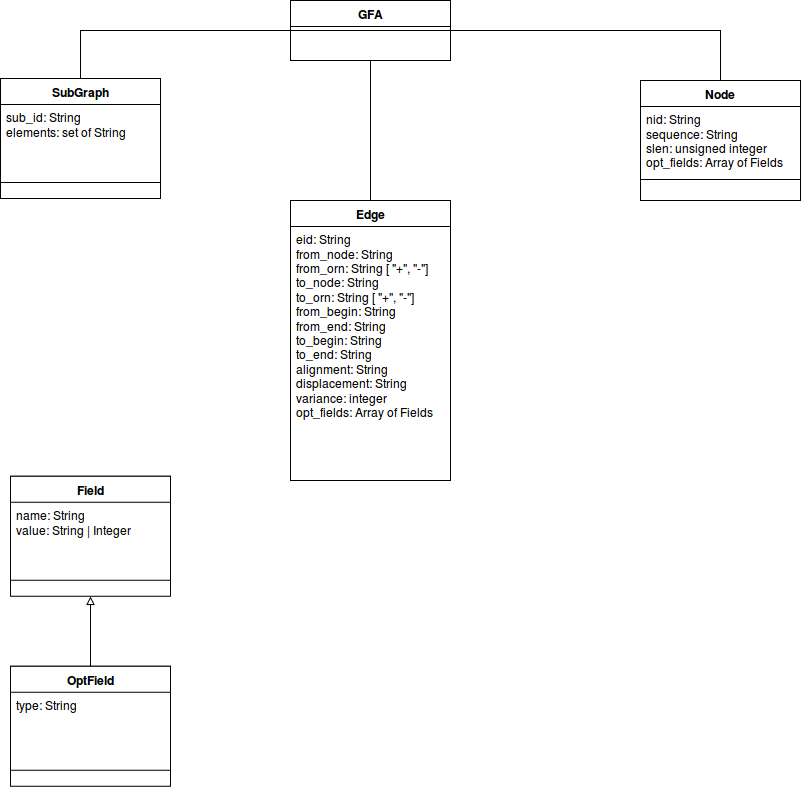

# PyGFA

PyGFA is a python library which use a NetworkX MultiGraph to contain
information stored in GFA1 and GFA2 files.
The graph is an abstract representation of the data coming from GFA
file, allowing to use the two specifications at the same time.

## Graph elements

The graph is composed by three main elements:

* **nodes** that store informations about a given sequence;

* **edges** that store informations relative the links between two
   sequences like similarity, being part of a group of sequences or gaps
   that keep the sequences separated by each other;

* **subgraphs** that store informations about groups of nodes and edges
   linked between each other in such a way that it's possibile to extract
   an independent subgraph from the main one.

Since the graph elements have to represent various concept - very similar
to each other - by a single entity, a study to best represent crucial
informations of each line of the GFA specification has been made.

All the graph elements are identified by the related *id* of the GFA element
where specified and it has been assigned a **virtual_identifier** for the
elements that didn't have a specific identifier.

________________________________________________________________________________

## Interaction with the Graph

The interaction with the graph has been tought to be the most coherent as
possible with the NetworkX MultiGraph object, trying to replicate its behaviour
and naming convention.

A main difference compared with GFA is the importance of the key
that the graph assigns to each element.

Since a good amount of edges and subgraphs aren't provided with an id,
the query for these elements is difficult due to the fact that a
virtual identifier is given to them at runtime and it's not possible
to predict the id associated with them (it's indeed possible
to see using the *pprint* - pretty print - function to identify the
element with the associated id).

