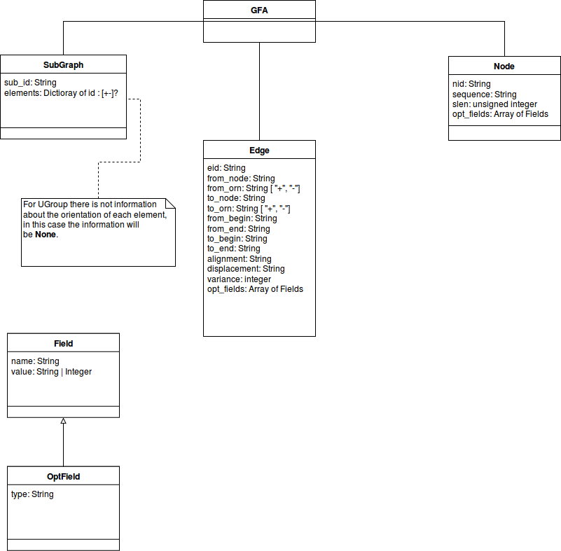

# PyGFA

PyGFA is a python library which use a NetworkX MultiGraph to contain
information stored in GFA1 and GFA2 files.
The graph is an abstract representation of the data coming from GFA
file, allowing to use the two specifications at the same time.


## Use cases

The library will allow users to manage the same informations stored
in a GFA file using a graph structure. The graph used is a multi-directed graph.

On the graph the user will be able to perform query operation, to extend
the graph by adding new GFA informations and to dump the graph back to a GFA
file.

Note that the graph accepts a Graph Element (GFA Edges, Nodes or Subgraphs)
to extend its informations, but indirectly (accessing the *_graph* attribute
of a GFA object) it's possible to add any type of object.

In addition it's possible to get a subgraph either by specifying the
required nodes or by getting all the nodes reachable from
a source node. This feature allows users to split useful information from
a very large GFA file.


________________________________________________________________________________

## Graph elements

The graph is composed by three main elements:

* **nodes** that store informations about a given sequence;

* **edges** that store informations relative the links between two
   sequences like similarity, being part of a group of sequences or gaps
   that keep the sequences separated by each other;

* **subgraphs** that store informations about groups of nodes and edges
   linked between each other in such a way that it's possibile to extract
   an independent subgraph from the main one.

Since the graph elements have to represent various concept - very similar
to each other - by a single entity, a study to best represent crucial
informations of each line of the GFA specification has been made.

All the graph elements are identified by the related *id* of the GFA element
where specified and it has been assigned a **virtual_identifier** for the
elements that didn't have a specific identifier.




________________________________________________________________________________

## Interaction with the Graph

The interaction with the graph has been tought to be the most coherent as
possible with the NetworkX MultiDiGraph object, trying to replicate its behaviour
and naming convention.

A main difference compared with GFA is the importance of the key
that the graph assigns to each element.

Since a good amount of edges and subgraphs aren't provided with an id,
the query for these elements is difficult due to the fact that a
virtual identifier is given to them at runtime and it's not possible
to predict the id associated with them (it's indeed possible
to see using the *pprint* - pretty print - function to identify the
element with the associated id).


________________________________________________________________________________

## A little example

In this brief paragraph I will try to focus on the main capabilites
of the library.

I will work on the GFA1 file placed under /data/sample1.gfa:

```
S	1	*
S	3	CGATGCTAGCTGACTGTCGATGCTGTGTG
L	1	+	2	+	12M	ID:Z:1_to_2
S	5	*
S	13	*
C	2	+	6	+	10	122M	ID:Z:2_to_6
P	14	11+,12+	122M
S	11	*
H	ac:Z:test2
S	12	*
S	4	*
H	VN:Z:1.0
L	1	+	3	+	12M	ID:Z:1_to_3
L	11	+	12	+	122M	ID:Z:11_to_12
S	6	*
L	11	+	13	+	120M	ID:Z:11_to_13
P	15	11+,13+	120M
S	2	*	xx:Z:sometag
H	aa:i:12	ab:Z:test1
H	aa:i:15
C	1	+	5	+	12	120M	ID:Z:1_to_5
```

Open a terminal emulator of your choice and go to
the root of the library. To start the demo of the program and keep
the interactive cli opened type:

> python3 -i demo.py -f data/sample1.gfa

A window with a graphical representation of the graph processed is
displayed and a pretty print representation of it is written into the
terminal.

To continue with the interactive cli close the graph window that just
popped up.


The graph is accessible using the *tmp_pygfa* variable.

This graph is quite interesting in that there are three connected components.
To obtain a graph with all the nodes reachable from node 1, type:

> tmp_pygfa.get_all_reachables('1')

This command performs a DFS-edge search on the edges connected to node 1,
giving back all the strongly connected component belonging to 1.

Now, let's type the same command on node 2. The nodes of the GFA graph returned
are just 2 and 6. The other nodes aren't reachable from node 2 but they all belong
to the same weakly connected component.
To get all a GFA graph made by all the weakly connected components, so
to get all the nodes that are directly or undirectly reachable from node 2, we
must type.

> tmp_pygfa.get_all_reachables('2', True)

Now we get the same nodes as calling the method on node 1.

### Search operations

Let's now focus on search operation.
It's possible to search for a specific value in a specific field.

For example, to search for all the nodes that have length undefined 'nid' 3, type:

> tmp_pygfa.search ('nid', '3')

Note that the search operation performs a query on all the elements of the graph
(nodes, edges and subgraphs).
It's possible to limit the elements to perform the search on, for example limiting
the search on nodes, by specifying the option **limit_type=gfa.Element.NODE**.

Finally, note that the search operates by applying a *comparator* to the element
it finds. By default an equality comparator is used, checking that the given
value is equal to the element considered.

A different comparator can be easily made by defining a new function.

For example, a comparator that return all values of the field specified
could be easily written as:

> tmp_pygfa.search ('slen', None, lambda x, y: True)

In this case the 'value' field is ignored.

To write a custom comparator remember that signature of the comaprator
must always have two values.
For example, to write a comparator that gets all the nodes with an id
between 0 and 10, one could make:

> tmp_pygfa.search ('nid', None, lambda x, y: int(x) in range (0, 10))

This grants great flexibilty to the user who can writes custom comparators
easily.

### Graph dumping

A dump method is provided to create a GFA1 or GFA2 file of the graph.
Since the generated file *must* respects the specifications, it's not
always possible to store every information to a selected specification.

Since GFA2 is a superset of GFA1 it's always possible to convert  most of the
informations to a GFA2 file. While it's impossible to convert GFA1 file to the
GFA2 specification.

For example, a GFA1 link it's impossible to convert to a GFA2 Edge, since
informations like 'from_positions' and 'to_positions' are not described
in the GFA1 specification.

To dump a graph call the method **dump** and specify the version
as its parameter.

> tmp_pygfa.dump () # for GFA1  
> tmp_pygfa.dump (2) # for GFA2

If some elements cannot be converted a debug log will appear.
As of now this is printed to the standard output, but will be further
modified.


