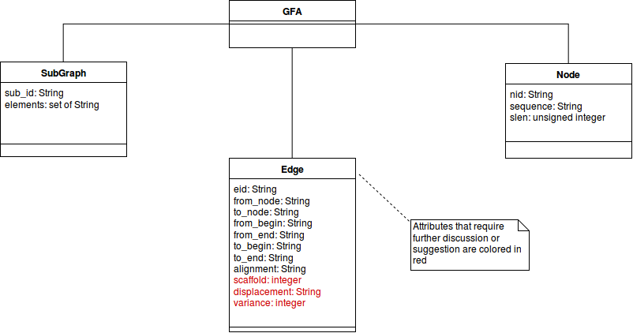

# Specification analysis for generating coherent graph representations

This document try to highlight how a concept is represented between the
two specifications GFA1 and GFA2.

This is required so that I can design the graph representation of each line
described in the specifications.

Since the only basic elements a graph can have are nodes and edges I need
to represent the information contained in the lines with either a Node or
an Edge element.

From this analysis I should understand the attributes that each Node and each Edge
should have.

In the grid are indicated the lines and the associated elements of the graph that
could represent them better.

| Line (GFA1) | Graph element |
|-------------|---------------|
| H           | **None**      |
| S    	      | Node	      |
| L    	      | Edge          |
| C    	      | Edge          |
| Path 	      | Subgraph      |

| Line (GFA2) | Graph element |
|-------------|---------------|
| H           | **None**      |
| S           | Node          |
| F           | Edge          |
| E           | Edge          |
| G           | Edge          |
| O           | Subgraph      |
| U           | Subgraph      |

________________________________________________________________________________

## Lines equivalence analysis

Now, I will compare each field of each line against the two specifications and
describe how each field could be represented in the graph element.

Since GFA2 is a superset of GFA1 I will try to find the GFA2 field that best
fit the field from GFA1.

I will use a table to describe how a concept is described in the two specifications
and the equivalent attribute of the graph element that could represent the cocnept.

### Header line

The version number of the specification could be lost or could be saved as a
graph attribute, but it shouldn't be so crucial.

If the header comes from GFA2 then the trace spacing (if present) could be extended
to each node of the *.gfa* file where the header line comes from.

Any optional field (user defined) of the header line could be saved as a list of optional field
into the class represented the entire graph.

### Segment line

| GFA1 Field                       | GFA2 Field | Node Attribute |
|----------------------------------|------------|----------------|
| Name                             | sid        | nid (node id)  |
| Sequence                         | sequence   | sequence       |
| LN (segment length)  or **None** | slen       | slen           |

### Link line

The GFA1 Link line best match is with GFA2 Edge line. Note that
to represent the link not all the Edge field are required to be set.

| GFA1 Field                   | GFA2 Field | Edge Attribute |
|------------------------------|------------|----------------|
| ID (Edge identifier) or None | eid        | eid (edge id)  |
| From 	   	       	       | sid1       | from_node      |
| From Orientation	       | None	    | from_orn	     |
| To   			       | sid2       | to_node        |
| To Orientation	       | None	    | to_orn	     |
| Overlap                      | alignment  | alignment      |

### Containment line

The Containment is very similar to the Link line, GFA2 in fact represents both with
an Edge line.

| GFA1 Field                   | GFA2 Field | Edge Attribute	   |
|------------------------------|------------|----------------------|
| ID (Edge identifier) or None | eid        | eid (edge id)        |
| From 	   	       	       | sid1       | from_node            |
| From Orientation	       | None	    | from_orn	           |
| To   			       | sid2       | to_node              |
| To Orientation	       | None	    | to_orn	           |
| pos                          | None       | **opt_field['pos']** |
| Overlap                      | alignment  | alignment            |

### Path line

The GFA2 line that best match the Containment line is the Ogroup line.

| GFA1 Field    | GFA2 Field | Subgraph Attribute |
|---------------|------------|--------------------|
| Path Name     | oid        | sub_id             |
| Segment Names | references | elements           |
| Overlaps      | **None**   | **None**           |

________________________________________________________________________________
## Represent leftover fields of GFA2

From the previous analysis some GFA2 remains untouched.
Here I'm going to describe how I would represent them in the graph.

### Fragment line

A Fragment could be described within an edge that point from the segment (an node
in the graph) described in the sid *field* of the line to the segment (so
another node) referenced to the *external* field.

| GFA2 Field | Edge Attribute |
|------------|----------------|
| **None**   | eid (edge id)  |
| sid        | from_node      |
| external   | to_node        |
| sbeg       | from_begin     |
| send       | from_end       |
| fbeg       | to_begin       |
| fend       | to_end         |
| alignment  | alignment      |

**Warning**: This way the fragment in the graph is similar to the Link/Edge rapresentation
within the graph.
They can be differentiated by:
* Since a Link doesn't have a name/id it's possible to represent this information with a
  **'\*'** in the graph

* If an Edge doesn't have an id, this information is represented with a **'\*'** in the
  field

* A fragment has **None** (**null** or **nil**) to represent this information.

So, eventually there should be no problems into distinguishing the different
types of informations.

### Edge line

For the Edge line are valid the same considerations explained for the Fragment line,
except that an Edge always has an id different from **None**.

| GFA2 Field | Edge Attribute  	     	|
|------------|--------------------------|
| eid        | eid (edge id)		|
| sid1       | from_node + from_orn     |
| sid2       | to_node + to_orn         |
| beg1       | from_begin               |
| end1       | from_end                 |
| beg2       | to_begin                 |
| end2       | to_end                   |
| alignment  | alignment                |

### Gap line

Gap lines can be represented within an Edge where the various from-to field are
**None** and the the *displacement* and *variance* fields are added.

This 2 additional fields are required only for gaps, so it could possibly
be implemented creating class propery at runtime (bad), or add this information
as user defined tags(?).

| GFA2 Field                      | Edge Attribute         |
|---------------------------------|------------------------|
| gid                             | eid (edge id)          |
| sid1                            | from_node + from_orn   |
| sid2                            | to_node                |
| disp (displacement)             | displacement	   |
| var (variance) or **None**      | variance               |

### Groups lines
O and U lines need further investigation. I think that they could be represented
as list of elements (the subgraph element they contain) with an optional id, so
I think to implement a SubGraph class and attach to the GFA graph a list of
istances of SubGraph that represente all Path, Ogroup and Ugroup from the two
specifications.

| GFA2 Field        | SubGraph Attribute |
|-------------------|--------------------|
| oid or uid        | sub_id             |
| references or ids | elements           |

###### A note on the separation of the Graph Element Edge from/to:
The Edge from/to fields have been splitted over two fields, the from/to
that will contain the clear id of the node and from_orn/to_orn that wil contain
the orientation of the node relative the link that the edge is describing.

This is needed to solve a conflict during the add_edge method of the gfa implementation
caused by the add of a fragment. Due to the fact that a fragment from_node is
represented by an **id** it wasn't possible to generalize the fragment with the other
type of lines that use the reference.

________________________________________________________________________________

## A rough concept of a design class diagram

