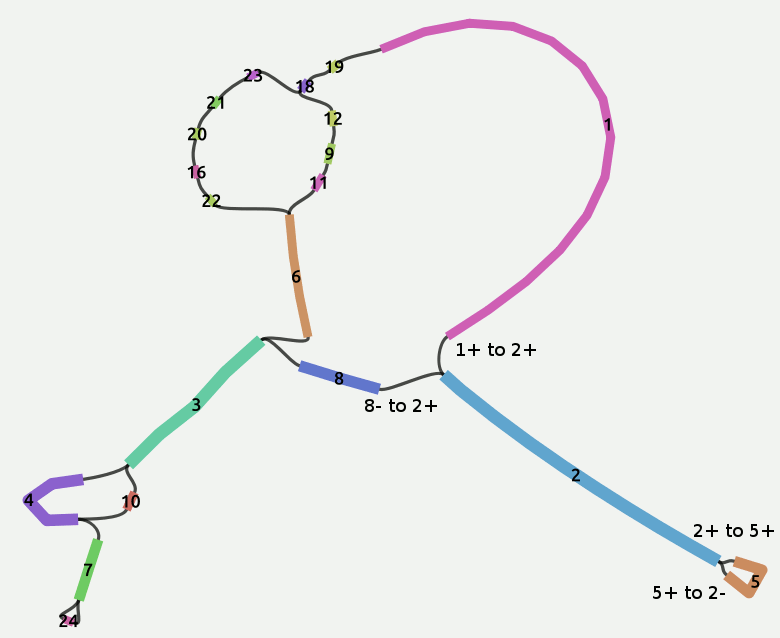
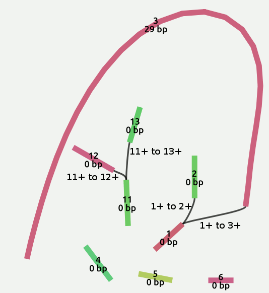

# Sequence management

In the GFA specification, each node generally represent a 
sequence, either defined inside the same file or into an external one,
like the `external` field in Fragment lines.

From a sequence, we distinguish its ends based on the strand where it
comes from.

Each node (sequence) can be linked to another by an edge.
An edge between two nodes can represent several situations:
* one sequence is inside another, like Containment lines,
* one sequence overlaps partly with another sequence, like
  general Edge lines,
* one of the end of a sequence overlaps with an end of another sequence,
  that is what is called a dovetail overlap.

The latter situation is very interesting since describes a sequence
continuum. Most of the graph operations worth performing work
on this kind of connections. This situation is the only one
that can be seen as a directional relationship between sequences,
in that it's useful to track the sequence end involved into
a dovetail overlap.

PyGFA edges represent any kind of connection betweeen two nodes.
The properties belonging to an edge, once a GFA line concepts
are abstracted and enveloped into a graph edge, are the only
way to retrieve the original behaviour of a link between nodes.

For this reason properties in PyGFA edges have been extended and
now include:
* a `is_dovetail` property set to True for edges
  that come from GFA1 Link lines and for GFA2 Edge lines that represent
  a dovetail overlap (considering the given positions where the overlap
  occurrs)
* a `from_segment_end` and `to_segment_end` that represent
  the end of the from_segment and to_segment involved into
  a dovetail overlap respectively (for other kind of connection this
  properties are undefined).

Let's consider the following graph:  


```
# some GFA1 lines 
S	2	*	LN:i:4589	RC:i:6428225
S	8	*	LN:i:876	RC:i:794734
L	2	-	8	+	10M

# Retrieve all the edges between node "2" and node "8"
>>> tmp_pygfa.edge(("2","8"))
{'virtual_14': {'alignment': '10M', 'to_node': '8', 'from_positions': (None, None), 'to_segment_end': 'L', 'distance': None, 'from_node': '2', 'from_segment_end': 'L', 'to_positions': (None, None), 'variance': None, 'eid': '*', 'is_dovetail': True, 'from_orn': '-', 'to_orn': '+'}}

# select the edge with id "virtual_14"
>>> tmp_pygfa.edge("virtual_14")
{'alignment': '10M', 'to_node': '8', 'from_positions': (None, None), 'to_segment_end': 'L', 'distance': None, 'from_node': '2', 'from_segment_end': 'L', 'to_positions': (None, None), 'variance': None, 'eid': '*', 'is_dovetail': True, 'from_orn': '-', 'to_orn': '+'}
```
A Link line in GFA1 describe specifically a dovetail overlap where
the end of the first sequence overlaps with the left of the second
sequence. If a `-` is present, the alignment occurs after the reverse
and complement of the sequence whose the sign is referred to.
This implies that if a minus occurs on the first sequence described
in the link, the end of the segment involved into the dovetail overlap
is the left one and not the right one, while a minus on the second
sequence implies that the overlap involves the right end of the second
sequence and not the left one.

For GFA2 Edge lines that describe a dovetail overlap the same rules
apply.

```
# pygfa/pygfa/graph_element/edge.py

def set_segments_end(self):
    """Set the segments ends considered by the
    edge, only for dovetail overlaps.
    Do nothing otherwise.
    """
    if not self.is_dovetail:
        return
    if self.from_orn == "+":
        self._from_segment_end = "R"
    else:
        self._from_segment_end = "L"
    if self.to_orn == "+":
        self._to_segment_end = "L"
    else:
        self._to_segment_end = "R"

```


## Dovetails iterator

Due to the important aspects of dovetail overlaps a way to
traverse the graph considering only this kind of connection
is needed. So PyGFA now offers a dovetail edges iterator that
allows to iterate over dovetail edges and nodes (sequence) involved into
dovetail overlaps.

This also allows to obtain a networkx subgraph where only
dovetail overlaps occurrs from a GFA graph, so excluding nodes
that would not be meaningful in operations such as linear path
searching or connected components operations (that consider
only dovetail overlaps remove components whose sequence length is
less than a given value for example -see [1](#references).)

Dovetail overlaps describe a sort of directed relationship
between sequence ends, so it's possible to find for each sequence
the sequences connected to each of its ends.

Considering a GFA(1 or 2) lines that describe a dovetail
overlap (either a Link or an Edge as said above) to get
all the sequences linked to one of the end (the left
for example) of a specific sequence (let's call it
source sequence) it's required not only to
consider the edges where the source sequence is the
"from_node" of the edge, but also all neighbouring edges
where the source node is also the "to_node".

```
# pygfa/pygfa/data/example1.gfa
...
S   1   *   LN:i:6871   RC:i:2200067
S   8   *   LN:i:876    RC:i:794734
S   2   *   LN:i:4589   RC:i:6428225
S   5   *   LN:i:1378   RC:i:1071246
L   1   +   2   +   10M
L   2   -   8   +   10M
L   2   +   5   +   10M
L   2   +   5   -   10M

>>> tmp_pygfa._graph.adj["2"]
{'1': {'virtual_0':  {'to_node': '2', 'to_segment_end': 'L', 'from_node': '1', 'from_segment_end': 'R',
                     'is_dovetail': True, 'from_orn': '+', 'to_orn': '+', ...}},

 '8': {'virtual_14': {'to_node': '8', 'to_segment_end': 'L', 'from_node': '2', 'from_segment_end': 'L',
                      'is_dovetail': True, 'from_orn': '-', 'to_orn': '+', ...}},

 '5': {'virtual_12': {'to_node': '5', 'to_segment_end': 'L', 'from_node': '2', 'from_segment_end': 'R',
                      'is_dovetail': True, 'from_orn': '+', 'to_orn': '+', ...},

       'virtual_13': {'to_node': '5', 'to_segment_end': 'R', 'from_node': '2', 'from_segment_end': 'R',
                      'is_dovetail': True, 'from_orn': '+', 'to_orn': '-', ...}}
}


>>>tmp_pygfa.left("2")
['1', '8']

>>> tmp_pygfa.right("2")
['5', '5']

```
See [2](#references) for the implementation of the right_end_iter
used by the right method.

Once implemented this functionality it's easy to add additional
iterators that consider the degree of edges representing dovetail
overlaps that involving of the sequence ends.

```
# same code as above
>>> tmp_pygfa.right_degree("2")
2
>>> tmp_pygfa.left_degree("2")
2
```

And it's now possible to write graph algorithms
that consider this specific kind of links automatically.
Such as:
* connected components
* remove dead ends considering only dovetail overlaps edges
* remove connected components where the whole sequence is
  shorter than a given length (i.e: remove_small_components)

## Examples

```
# pygfa/data/sample1.gfa

S   1   *
S   3   CGATGCTAGCTGACTGTCGATGCTGTGTG
L   1   +   2   +   12M ID:Z:1_to_2
S   5   *
S   13  *
C   2   +   6   +   10  122M    ID:Z:2_to_6
P   14  11+,12+ 122M
S   11  *
H   ac:Z:test2
S   12  *
S   4   *
H   VN:Z:1.0
L   1   +   3   +   12M ID:Z:1_to_3
L   11  +   12  +   122M    ID:Z:11_to_12
S   6   *
L   11  +   13  +   120M    ID:Z:11_to_13
P   15  11+,13+ 120M
S   2   *   xx:Z:sometag
H   aa:i:12 ab:Z:test1
H   aa:i:15
C   1   +   5   +   12  120M    ID:Z:1_to_5

```


Now I will find for the conneceted component (considering only dovetail overlap)
that contains the node "1". Note that a containment is linked to the node 1,
but it wont't appear in the result since it's not a dovetail overlap.
Then I will find all the connceted components.
In the end I will remove dead ends with sequence shorter than
1 base pair.


```
>>> import pygfa
>>> pygfa.dovetails_nodes_connected_component(tmp_pygfa, "1")
{'2', '1', '3'}

>>> list(pygfa.dovetails_nodes_connected_components(tmp_pygfa))
[{'13', '12', '11'}, {'2', '1', '3'}, {'4'}, {'5'}, {'6'}

>>> tmp_pygfa.remove_dead_ends(1)
>>> list(pygfa.dovetails_nodes_connected_components(tmp_pygfa))
[{'1', '3'}, {'11'}]
```
**Note that at the moment nodes without edges (dovetail overlap edges),
either to the right or to the left, are removed.**

### References
1. pygfa/pygfa/gfa.py -> remove_small_components:
```
def remove_small_components(self, min_length):
        """...doc"""
        conn_components = pygfa.dovetails_nodes_connected_components(self)
        for conn_comp in conn_components:
            length = 0
            for nid in conn_comp:
                node_ = self.node(nid)
                try:
                    length += node_['slen']
                except (TypeError, KeyError):
                    pass
            if length < min_length:
                for nid in conn_comp:
                    self.remove_node(nid)
```
2. pygfa/pygfa/dovetail_operations/iterator.py -> right_end_iter
```
def right_end_iter(self, nbunch, keys=False, data=False):
        """Return an iterator over dovetail edges where
        nodes id  right-segment end is taken into account
        in the overlap
        """
        try:
            if nbunch is None:
                nids = set(self.nodes())
            elif isinstance(nbunch, str):
                raise TypeError
            else:
                nids = set(nbunch)
        except TypeError:
            nids = set()
            nids.add(nbunch)
        for nid in nids:
            for from_node, to_node, key, edge_ in self.dovetails_neighbors_iter(nid, keys=True, data=True):
                if nid == edge_["from_node"] \
                  and edge_["from_segment_end"] == "R":
                    if data is True:
                        yield (from_node, to_node, key, edge_) if keys \
                          else (from_node, to_node, edge_)
                    else:
                        yield (from_node, to_node, key) if keys \
                          else (from_node, to_node)
                if nid == edge_["to_node"] \
                  and edge_["to_segment_end"] == "R":
                    if data is True:
                        yield (from_node, to_node, key, edge_) if keys \
                          else (from_node, to_node, edge_)
                    else:
                        yield (from_node, to_node, key) if keys \
                          else (from_node, to_node)

```
