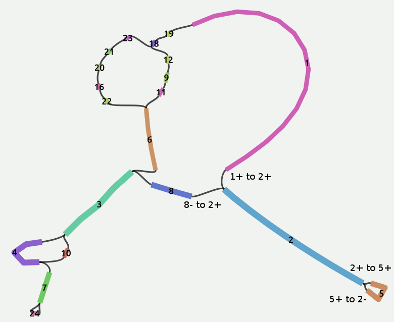
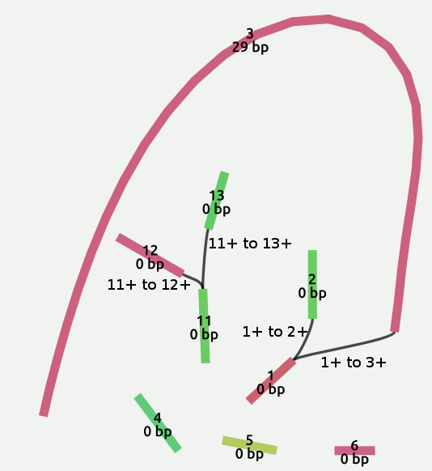

# Sequence management

In the GFA specification, each node generally represent a 
sequence, either defined inside the same file or into an external one,
like the `external` field in Fragment lines.

From a sequence, we distinguish its ends based on the strand where it
comes from.

Each node (sequence) can be linked to another by an edge.
An edge between two nodes can represent several situations:
* one sequence is inside another, like Containment lines,
* one sequence overlaps partly with another sequence, like
  general Edge lines,

The latter situation is very interesting since describes a sequence
continuum. Most of the graph operations worth performing work
on this kind of connections. This situation is the only one
that can be seen as a directional relationship between sequences.

PyGFA edges represent any kind of connection betweeen two nodes.
The properties belonging to an edge, once a GFA line concepts
are abstracted and enveloped into a graph edge, are the only
way to retrieve the original behaviour of a link between nodes.

Let's consider the following graph:  


```
# some GFA1 lines 
S	2	*	LN:i:4589	RC:i:6428225
S	8	*	LN:i:876	RC:i:794734
L	2	-	8	+	10M

# Retrieve all the edges between node "2" and node "8"
>>> tmp_pygfa.edge(("2","8"))
{'virtual_14': {'alignment': '10M', 'to_node': '8', 'from_positions': (None, None), 'to_segment_end': 'L', 'distance': None, 'from_node': '2', 'from_segment_end': 'L', 'to_positions': (None, None), 'variance': None, 'eid': '*', 'from_orn': '-', 'to_orn': '+'}}

# select the edge with id "virtual_14"
>>> tmp_pygfa.edge("virtual_14")
{'alignment': '10M', 'to_node': '8', 'from_positions': (None, None), 'to_segment_end': 'L', 'distance': None, 'from_node': '2', 'from_segment_end': 'L', 'to_positions': (None, None), 'variance': None, 'eid': '*', 'from_orn': '-', 'to_orn': '+'}
```
A Link line in GFA1 describe specifically an overlap where
the end of the first sequence overlaps with the left of the second
sequence. If a `-` is present, the alignment occurs after the reverse
and complement of the sequence whose the sign is referred to.
This implies that if a minus occurs on the first sequence described
in the link, the end of the segment involved into the overlap
is the left one and not the right one, while a minus on the second
sequence implies that the overlap involves the right end of the second
sequence and not the left one.

## Iterator

Due to the important aspects of overlaps a way to
traverse the graph considering only this kind of connection
is needed. So PyGFA now offers a  edges iterator that
allows to iterate over edges and nodes (sequence) involved into
overlaps.

This also allows to obtain a networkx subgraph where only
overlaps occurrs from a GFA graph, so excluding nodes
that would not be meaningful in operations such as linear path
searching or connected components operations (that consider
only overlaps remove components whose sequence length is
less than a given value for example -see [1](#references).)

overlaps describe a sort of directed relationship
between sequence ends, so it's possible to find for each sequence
the sequences connected to each of its ends.

Considering a GFA lines that describe a 
overlap (either a Link or an Edge as said above) to get
all the sequences linked to one of the end (the left
for example) of a specific sequence (let's call it
source sequence) it's required not only to
consider the edges where the source sequence is the
"from_node" of the edge, but also all neighbouring edges
where the source node is also the "to_node".

```
# pygfa/pygfa/data/example1.gfa
...
S   1   *   LN:i:6871   RC:i:2200067
S   8   *   LN:i:876    RC:i:794734
S   2   *   LN:i:4589   RC:i:6428225
S   5   *   LN:i:1378   RC:i:1071246
L   1   +   2   +   10M
L   2   -   8   +   10M
L   2   +   5   +   10M
L   2   +   5   -   10M

>>> tmp_pygfa._graph.adj["2"]
{'1': {'virtual_0':  {'to_node': '2', 'to_segment_end': 'L', 'from_node': '1', 'from_segment_end': 'R',
                     'from_orn': '+', 'to_orn': '+', ...}},

 '8': {'virtual_14': {'to_node': '8', 'to_segment_end': 'L', 'from_node': '2', 'from_segment_end': 'L',
                     'from_orn': '-', 'to_orn': '+', ...}},

 '5': {'virtual_12': {'to_node': '5', 'to_segment_end': 'L', 'from_node': '2', 'from_segment_end': 'R',
                      'from_orn': '+', 'to_orn': '+', ...},

       'virtual_13': {'to_node': '5', 'to_segment_end': 'R', 'from_node': '2', 'from_segment_end': 'R',
                     'from_orn': '+', 'to_orn': '-', ...}}
}


>>>tmp_pygfa.left("2")
['1', '8']

>>> tmp_pygfa.right("2")
['5', '5']

```
See [2](#references) for the implementation of the right_end_iter
used by the right method.

Once implemented this functionality it's easy to add additional
iterators that consider the degree of edges representing 
overlaps that involving of the sequence ends.

```
# same code as above
>>> tmp_pygfa.right_degree("2")
2
>>> tmp_pygfa.left_degree("2")
2
```

And it's now possible to write graph algorithms
that consider this specific kind of links automatically.
Such as:
* connected components
* remove dead ends considering only overlaps edges
* remove connected components where the whole sequence is
  shorter than a given length (i.e: remove_small_components)

## Examples

```
# pygfa/data/sample1.gfa

S   1   *
S   3   CGATGCTAGCTGACTGTCGATGCTGTGTG
L   1   +   2   +   12M ID:Z:1_to_2
S   5   *
S   13  *
C   2   +   6   +   10  122M    ID:Z:2_to_6
P   14  11+,12+ 122M
S   11  *
H   ac:Z:test2
S   12  *
S   4   *
H   VN:Z:1.0
L   1   +   3   +   12M ID:Z:1_to_3
L   11  +   12  +   122M    ID:Z:11_to_12
S   6   *
L   11  +   13  +   120M    ID:Z:11_to_13
P   15  11+,13+ 120M
S   2   *   xx:Z:sometag
H   aa:i:12 ab:Z:test1
H   aa:i:15
C   1   +   5   +   12  120M    ID:Z:1_to_5

```


Now I will find for the conneceted component (considering only overlap)
that contains the node "1". Note that a containment is linked to the node 1,
but it wont't appear in the result since it's not a overlap.
Then I will find all the connceted components.
In the end I will remove dead ends with sequence shorter than
1 base pair.
